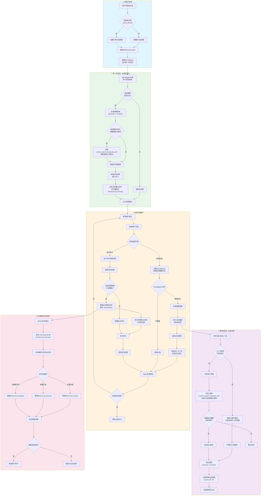

# 记忆系统优化 PRD

## 文档信息
- **版本**: 1.0
- **日期**: 2026-02-06
- **状态**: 草案

---

## 1. 背景与现状

### 1.1 当前架构
当前记忆系统采用两层架构：
- **Layer 1**: 记忆摘要（summary）作为占位符存储在上下文中
- **Layer 2**: 完整内容（content）存储在数据库中

### 1.2 现有问题

#### 1.2.1 搜索能力局限
- **简单关键字匹配**: 使用 SQL `ILIKE` 进行子串匹配，无向量相似度
- **无语义理解**: 无法找到概念相关但关键词不同的记忆
- **无相关性排序**: 结果按时间而非相关性返回

#### 1.2.2 查询机制僵化
- **预生成查询**: `init_memory()` 在对话开始前一次性生成查询
- **无法动态扩展**: 对话过程中无法根据新上下文搜索更多记忆
- **Agent 无主动权**: Agent 不能自主决定何时搜索记忆

#### 1.2.3 关键词管理缺失
- **无关键词提取**: 不存储记忆的关键词标签
- **无关键词索引**: 无法通过关键词快速定位记忆
- **无权重机制**: 无法区分关键词重要性

---

## 2. 目标

### 2.1 主要目标
1. **工具化记忆查询**: 让 Agent 能够主动调用记忆工具搜索历史信息
2. **增强关键词搜索**: 支持多维度关键词搜索和智能匹配
3. **动态记忆加载**: 根据对话进展实时加载相关记忆

### 2.2 非目标
- 实现向量数据库存储（保留为后续迭代）
- 跨用户记忆共享
- 记忆自动合并与抽象

---

## 3. 需求详细设计

### 3.1 记忆工具 (Memory Tools)

#### 3.1.1 需求概述
将记忆查询封装为 Agent 可调用的工具，使 Agent 能够：
- 根据当前上下文决定何时搜索记忆
- 指定搜索策略和参数
- 获取结构化的记忆结果

#### 3.1.2 工具接口设计

```python
# 工具: search_memories
class SearchMemoriesInput(BaseModel):
    """记忆搜索工具输入"""
    query: str = Field(..., description="搜索查询，可以是自然语言描述或关键词")
    search_mode: Literal["semantic", "keyword", "hybrid"] = Field(
        default="hybrid",
        description="搜索模式: semantic-语义匹配, keyword-关键词匹配, hybrid-混合"
    )
    keywords: Optional[List[str]] = Field(
        default=None,
        description="可选的精确关键词列表，用于精确过滤"
    )
    memory_types: Optional[List[str]] = Field(
        default=None,
        description="按记忆类型过滤，如 ['user_preference', 'command_output']"
    )
    time_range: Optional[Tuple[datetime, datetime]] = Field(
        default=None,
        description="时间范围过滤"
    )
    limit: int = Field(default=5, ge=1, le=20, description="返回结果数量限制")
    min_relevance_score: float = Field(
        default=0.6,
        ge=0.0,
        le=1.0,
        description="最小相关性分数阈值"
    )

class MemorySearchResult(BaseModel):
    """记忆搜索结果"""
    memory_key: str
    summary: str
    content_preview: str  # 前200字符
    memory_type: Optional[str]
    relevance_score: float
    created_at: datetime
    keywords: List[str]
    metadata: Dict[str, Any]

class SearchMemoriesOutput(BaseModel):
    """记忆搜索工具输出"""
    total_found: int
    results: List[MemorySearchResult]
    search_strategy_used: str
    expanded_keywords: Optional[List[str]]  # 系统扩展的同义词/相关词
```

#### 3.1.3 工具注册与使用

```python
# 在 AgentBuilder 中注册记忆工具
class AgentBuilder:
    def _build_memory_tools(self) -> List[Tool]:
        """构建记忆相关工具"""
        return [
            FunctionTool(
                name="search_memories",
                description="""搜索用户的历史记忆。

使用场景:
1. 用户提到之前讨论过的话题时
2. 需要了解用户偏好或历史操作时
3. 需要验证或引用之前的结论时
4. 上下文出现不明确的引用时

示例:
- "我之前让你配置的参数" -> search_memories(query="配置参数", memory_types=["command_output"])
- "还是按之前的方式处理" -> search_memories(query="处理方式", search_mode="semantic")
""",
                func=self._search_memories_tool,
                input_model=SearchMemoriesInput,
                output_model=SearchMemoriesOutput
            ),
            FunctionTool(
                name="get_memory_detail",
                description="获取特定记忆的完整内容",
                func=self._get_memory_detail_tool,
                input_model=GetMemoryDetailInput,
                output_model=GetMemoryDetailOutput
            )
        ]
```

### 3.2 关键词搜索增强

#### 3.2.1 需求概述
建立完整的关键词管理体系，支持：
- 自动关键词提取与存储
- 关键词索引与快速检索
- 同义词扩展与语义关联

#### 3.2.2 数据库 Schema 扩展

```sql
-- 新增: 记忆关键词关联表
CREATE TABLE agent_memory_keywords (
    id SERIAL PRIMARY KEY,
    memory_id UUID NOT NULL REFERENCES agent_memories(id) ON DELETE CASCADE,
    keyword VARCHAR(100) NOT NULL,
    weight FLOAT DEFAULT 1.0,  -- 关键词权重 (0.0-1.0)
    extraction_source VARCHAR(20) DEFAULT 'llm',  -- 'llm', 'user_tag', 'system'
    created_at TIMESTAMP DEFAULT CURRENT_TIMESTAMP,

    CONSTRAINT unique_memory_keyword UNIQUE (memory_id, keyword)
);

-- 新增: 关键词同义词表
CREATE TABLE keyword_synonyms (
    id SERIAL PRIMARY KEY,
    keyword VARCHAR(100) NOT NULL,
    synonym VARCHAR(100) NOT NULL,
    similarity_score FLOAT DEFAULT 0.8,  -- 相似度分数

    CONSTRAINT unique_keyword_synonym UNIQUE (keyword, synonym)
);

-- 索引
CREATE INDEX idx_memory_keywords_memory ON agent_memory_keywords(memory_id);
CREATE INDEX idx_memory_keywords_keyword ON agent_memory_keywords(keyword);
CREATE INDEX idx_keyword_synonyms_keyword ON keyword_synonyms(keyword);
```

#### 3.2.3 SQLAlchemy 模型

```python
# data_layer/models/tables/agent_memory_keywords_table.py
class AgentMemoryKeywordsTable(Base):
    __tablename__ = "agent_memory_keywords"

    id: Mapped[int] = mapped_column(Integer, primary_key=True)
    memory_id: Mapped[UUID] = mapped_column(
        ForeignKey("agent_memories.id", ondelete="CASCADE"),
        nullable=False
    )
    keyword: Mapped[str] = mapped_column(String(100), nullable=False)
    weight: Mapped[float] = mapped_column(Float, default=1.0)
    extraction_source: Mapped[str] = mapped_column(String(20), default="llm")
    created_at: Mapped[datetime] = mapped_column(DateTime, default=datetime.utcnow)

# data_layer/models/tables/keyword_synonyms_table.py
class KeywordSynonymsTable(Base):
    __tablename__ = "keyword_synonyms"

    id: Mapped[int] = mapped_column(Integer, primary_key=True)
    keyword: Mapped[str] = mapped_column(String(100), nullable=False)
    synonym: Mapped[str] = mapped_column(String(100), nullable=False)
    similarity_score: Mapped[float] = mapped_column(Float, default=0.8)
```

#### 3.2.4 关键词提取策略

```python
class KeywordExtractor:
    """记忆关键词提取器"""

    async def extract_keywords(
        self,
        content: str,
        summary: str,
        memory_type: Optional[str] = None,
        max_keywords: int = 5
    ) -> List[Tuple[str, float]]:
        """
        提取关键词并返回 (keyword, weight) 列表

        策略:
        1. LLM 提取: 使用 LLM 提取核心概念关键词
        2. 规则增强: 根据 memory_type 添加类型相关关键词
        3. 用户标签: 保留用户手动添加的标签
        4. 去重归一: 统一大小写，去除重复
        """

    async def expand_keywords(
        self,
        keywords: List[str],
        include_synonyms: bool = True,
        include_semantic: bool = True
    ) -> Dict[str, List[str]]:
        """
        扩展关键词以支持更广泛匹配

        Returns:
            {
                "original": ["原始关键词"],
                "synonyms": ["同义词"],
                "related": ["语义相关词"]
            }
        """
```

### 3.3 搜索算法优化

#### 3.3.1 混合搜索策略

```python
class HybridMemorySearch:
    """混合记忆搜索引擎"""

    async def search(
        self,
        query: str,
        keywords: Optional[List[str]] = None,
        search_mode: str = "hybrid",
        **filters
    ) -> List[ScoredMemoryResult]:
        """
        执行混合搜索

        算法:
        1. 关键词匹配 (40% 权重)
           - 精确匹配: 1.0 分
           - 前缀匹配: 0.8 分
           - 同义词匹配: 0.7 分

        2. 文本相似度 (40% 权重)
           - 标题/摘要相似度 (TF-IDF + BM25)
           - 内容预览相似度

        3. 时间衰减 (20% 权重)
           - 越新的记忆权重越高
           - 使用指数衰减函数
        """

    def _calculate_keyword_score(
        self,
        memory_keywords: List[AgentMemoryKeywordsTable],
        query_keywords: List[str]
    ) -> float:
        """计算关键词匹配分数"""

    def _calculate_text_similarity(
        self,
        query: str,
        summary: str,
        content: str
    ) -> float:
        """计算文本相似度分数"""

    def _apply_time_decay(
        self,
        base_score: float,
        created_at: datetime,
        half_life_days: float = 30.0
    ) -> float:
        """应用时间衰减"""
        age_days = (datetime.utcnow() - created_at).days
        decay_factor = 0.5 ** (age_days / half_life_days)
        return base_score * (0.5 + 0.5 * decay_factor)  # 保留至少50%分数
```

#### 3.3.2 搜索结果排序

```python
class SearchResultRanker:
    """搜索结果排序器"""

    def rank_results(
        self,
        results: List[ScoredMemoryResult],
        query_context: Optional[str] = None
    ) -> List[ScoredMemoryResult]:
        """
        对搜索结果进行最终排序

        排序因子:
        1. 基础相关性分数 (70%)
        2. 用户交互历史 (20%) - 被召回次数、上次访问时间
        3. 记忆类型优先级 (10%) - user_preference > command_output > general
        """
```

### 3.4 MemoryContext 优化

#### 3.4.1 工具调用集成

```python
class MemoryContext(ChatCompletionContext):
    """优化后的记忆上下文"""

    def __init__(
        self,
        *,
        data_layer: AgentFusionDataLayer,
        user_id: int,
        memory_model_client: ChatCompletionClient,
        enable_proactive_search: bool = True,
        proactive_search_threshold: float = 0.7
    ):
        self.data_layer = data_layer
        self.user_id = user_id
        self.memory_model_client = memory_model_client
        self.enable_proactive_search = enable_proactive_search
        self.proactive_search_threshold = proactive_search_threshold

        # 记忆工具注册
        self.memory_tools = self._init_memory_tools()

    async def get_messages(self) -> List[LLMMessage]:
        """
        获取消息列表，支持 Agent 调用记忆工具

        流程:
        1. 获取基础消息列表
        2. 如果 Agent 有 search_memories 工具调用，执行搜索
        3. 将搜索结果注入到上下文中
        4. 返回完整消息列表
        """

    async def _handle_tool_calls(
        self,
        tool_calls: List[ToolCall],
        stream: asyncio.Queue[BaseAgentEvent | BaseChatMessage | None]
    ) -> List[ToolResult]:
        """处理记忆相关工具调用

        参考CodeAgent实现，使用asyncio.Queue支持流式输出，
        通过create_task异步执行工具调用。
        """
        results = []
        for call in tool_calls:
            if call.name == "search_memories":
                # 发送工具执行事件到流
                await stream.put(ToolCallExecutionEvent(
                    content=f"正在搜索记忆: {call.arguments.get('keywords', [])}",
                    source=self.name
                ))
                result = await self._execute_memory_search(call.arguments)
                results.append(ToolResult(call_id=call.id, result=result))
                # 发送执行完成事件
                await stream.put(ToolCallResultEvent(
                    content=f"找到 {len(result)} 条相关记忆",
                    source=self.name
                ))
        return results

    async def execute_memory_tools_with_stream(
        self,
        tool_calls: List[ToolCall]
    ) -> AsyncGenerator[BaseAgentEvent | BaseChatMessage, None]:
        """流式执行记忆工具调用

        使用方式（参考CodeAgent._run_step_impl）:
        ```python
        stream = asyncio.Queue[BaseAgentEvent | BaseChatMessage | None]()
        task = asyncio.create_task(self._handle_tool_calls(tool_calls, stream))

        while True:
            event = await stream.get()
            if event is None:
                break
            yield event

        results = await task
        ```
        """
        stream: asyncio.Queue[BaseAgentEvent | BaseChatMessage | None] = asyncio.Queue()

        task = asyncio.create_task(self._handle_tool_calls(tool_calls, stream))

        while True:
            event = await stream.get()
            if event is None:
                break
            yield event

        results = await task
        yield results
```

#### 3.4.2 主动记忆提示

```python
# 系统提示模板，指导 Agent 使用记忆工具
MEMORY_TOOLS_SYSTEM_PROMPT = """你是一个智能助手，拥有访问用户历史记忆的权限。

## 记忆工具使用指南

当你需要以下信息时，请主动调用 `search_memories` 工具：

1. **用户提及历史内容**
   - 用户说："按照之前的配置"、"我之前问过"、"上次的方案"
   - 操作：调用 search_memories 搜索相关主题

2. **用户偏好与习惯**
   - 需要了解用户的风格偏好、常用设置
   - 操作：搜索 memory_types=["user_preference"] 的记忆

3. **复杂任务延续**
   - 多轮对话中需要引用之前步骤的结果
   - 操作：使用关键词搜索相关步骤

4. **不确定性澄清**
   - 对用户请求中的模糊引用不确定时
   - 操作：使用 semantic 模式搜索相关记忆

## 搜索策略建议

- **精确查找**: 使用 keywords 参数指定确切词汇
- **模糊匹配**: 使用 search_mode="semantic" 进行语义搜索
- **类型过滤**: 使用 memory_types 缩小搜索范围
- **时间范围**: 对于近期事件使用时间过滤

## 搜索结果使用

搜索结果会显示相关性分数（0-1），建议：
- 优先使用分数 > 0.8 的记忆
- 0.6-0.8 的记忆作为参考
- 多个相关记忆时综合判断
"""
```

### 3.4.3 记忆召回完整流程图

#### 流程概述



#### 详细步骤说明

##### 记忆注入方式判断逻辑

流程图中 **K5 → K6[动态注入上下文 或 生成占位符]** 的判断依据如下：

| 场景 | 处理方式 | 说明 |
|------|---------|------|
| **用户普通消息** | **动态注入上下文** | 将记忆的完整内容或摘要直接展开，注入到当前对话上下文中，Agent 可立即参考 |
| **用户执行命令** | **生成占位符** | 生成 `[memory:key]` 占位符，命令执行前再替换为实际内容 |

**判断代码示例**：

```python
class MemoryContext:
    async def inject_memory_results(
        self,
        search_results: List[Memory],
        message_type: str,  # "user_chat" | "command"
    ) -> Union[str, List[MemoryPlaceholder]]:
        """
        根据消息类型决定记忆注入方式

        - 用户消息: 直接展开记忆内容，注入上下文
        - 命令: 生成占位符，延迟到执行时替换
        """
        if message_type == "command":
            # 命令场景：生成占位符
            # 例如: [memory:db-config-123] 替换为实际的数据库配置
            placeholders = [
                MemoryPlaceholder(
                    key=mem.key,
                    display_format=f"[memory:{mem.key}]"
                )
                for mem in search_results
            ]
            return placeholders

        else:  # user_chat
            # 普通对话：直接展开记忆内容
            # 将记忆内容格式化为文本，加入系统提示或用户上下文
            memory_texts = []
            for mem in search_results:
                memory_texts.append(
                    f"相关历史记忆 [{mem.key}]:\n"
                    f"摘要: {mem.summary}\n"
                    f"内容: {mem.content[:500]}..."
                )
            return "\n\n".join(memory_texts)
```

**使用示例**：

```
场景1 - 用户普通消息（直接展开）:
  用户: "按照我之前的数据库配置"
  处理: 搜索记忆后，将数据库配置的完整内容注入上下文
  Agent看到的: "相关历史记忆 [db-config-001]: 摘要: MySQL主从配置 内容: server-id=1..."

场景2 - 跨会话命令引用（占位符展开）:
  时间线:
    上周: 用户执行了 "python train.py --epochs 100"（被记录为记忆 cmd-001）
    今天: 用户开启新对话，说 "重新执行上次的训练命令"

  处理流程:
    1. 初始化时通过 RecallAgent 搜索记忆
    2. 找到记忆 cmd-001: "python train.py --epochs 100"
    3. 因为是用户消息（非直接命令），将记忆内容展开注入上下文
       Agent 看到的上下文:
       "用户消息: 重新执行上次的训练命令
        相关历史记忆 [cmd-001]: 训练命令
        内容: python train.py --epochs 100"
    4. Agent 理解后决定执行该命令
    5. 命令执行阶段使用占位符:
       - 内部命令表示: "执行 [memory:cmd-001]"
       - 执行前展开为: "python train.py --epochs 100"
```

---

##### 阶段一: 初始化与第一轮召回

```python
class MemoryContext:
    async def init_memory(self, user_message: str) -> List[LLMMessage]:
        """
        对话初始化时的记忆召回流程

        步骤:
        1. 检查是否是新对话（无历史消息）
        2. 调用RecallAgent分析用户初始意图
        3. 如果需要历史记忆，执行第一轮召回
        4. 将召回的记忆以占位符形式注入系统提示

        Returns:
            包含记忆占位符的系统消息列表
        """
        messages = []

        # Step 1: 判断是否需要召回
        recall_decision = await self.recall_agent.should_recall(
            message=user_message,
            context_type="initialization"
        )

        if recall_decision.needs_recall:
            # Step 2: 可选 - 使用 extract_search_keywords_tool 提取结构化关键词
            # 当用户查询较复杂时，先提取关键词提高搜索精度
            if recall_decision.is_complex_query:
                keyword_result = await extract_search_keywords_tool(
                    model_client=self.memory_model_client,
                    input_data=ExtractKeywordsInput(
                        query=user_message,
                        context="对话初始化",
                        max_keywords=5
                    )
                )
                recall_decision.keywords = [kw.keyword for kw in keyword_result.keywords]

            # Step 3: 执行第一轮召回（最多3轮尝试）
            memories = await self._execute_recall_with_retry(
                queries=recall_decision.search_queries,
                max_rounds=3,
                min_results=2
            )

            # Step 3: 生成记忆槽占位符
            memory_placeholders = self._generate_placeholders(memories)

            # Step 4: 构建系统提示
            system_prompt = self._build_system_prompt(memory_placeholders)
            messages.append(SystemMessage(content=system_prompt))

        return messages

    async def _execute_recall_with_retry(
        self,
        queries: List[SearchQuery],
        max_rounds: int = 3,
        min_results: int = 2
    ) -> List[Memory]:
        """
        多轮召回执行，直到获取足够记忆或达到最大轮数

        Round 1: 使用原始查询精确搜索
        Round 2: 扩展同义词，放宽匹配条件
        Round 3: 纯语义搜索，扩大搜索范围
        """
        all_memories = []

        for round_num in range(1, max_rounds + 1):
            # 每轮调整搜索策略
            search_params = self._adjust_search_params(queries, round_num)

            results = await self.search_memories(**search_params)
            all_memories.extend(results)

            # 去重
            all_memories = self._deduplicate_memories(all_memories)

            # 检查是否满足最小结果数
            if len(all_memories) >= min_results:
                break

        return all_memories[:10]  # 最多返回10条

    def _generate_placeholders(self, memories: List[Memory]) -> List[MemoryPlaceholder]:
        """
        生成记忆槽占位符

        格式:
        - [memory:{key}:summary] - 摘要引用
        - [memory:{key}:full] - 完整内容（用于重要记忆）
        - [memory:{key}:meta:{field}] - 元数据字段
        """
        placeholders = []
        for mem in memories:
            placeholder = MemoryPlaceholder(
                key=mem.key,
                display_format=f"[memory:{mem.key}:{mem.summary[:50]}...]",
                full_content=mem.content,
                relevance_score=mem.relevance_score
            )
            placeholders.append(placeholder)
        return placeholders
```

##### 阶段二: 消息级别的记忆判断

```python
class RecallAgent:
    async def should_recall(
        self,
        message: str,
        context_type: str,  # "initialization" | "mid_conversation" | "command"
        conversation_history: List[LLMMessage] = None
    ) -> RecallDecision:
        """
        判断是否需要召回记忆

        判断维度:
        1. 关键词触发: "之前"、"上次"、"说过"、"配置过"
        2. 指代消解: "那个方案"、"之前的设置"
        3. 任务延续: 多轮任务中的上下文缺失
        4. 用户偏好: 涉及个人习惯的请求

        Returns:
            RecallDecision: 包含是否需要召回、搜索查询列表、紧急程度
        """
        # 使用轻量级模型进行快速判断
        prompt = self._build_recall_decision_prompt(
            message=message,
            context_type=context_type,
            history=conversation_history
        )

        response = await self.model_client.complete(prompt)

        # 解析判断结果
        decision = self._parse_recall_decision(response.content)

        return decision

    async def analyze_message_intent(
        self,
        message: str
    ) -> IntentAnalysis:
        """
        分析用户消息意图，判断记忆需求

        意图类型:
        - INFORMATION_SEEKING: 查询历史信息
        - TASK_CONTINUATION: 继续之前任务
        - PREFERENCE_BASED: 基于偏好的请求
        - COMMAND_EXECUTION: 执行命令（可能引用历史）
        - GENERAL_CHAT: 普通对话
        """
        prompt = f"""
        分析以下用户消息的意图，判断是否需要历史记忆：

        用户消息: {message}

        请输出JSON格式:
        {{
            "intent_type": "INFORMATION_SEEKING|TASK_CONTINUATION|PREFERENCE_BASED|COMMAND_EXECUTION|GENERAL_CHAT",
            "needs_memory": true/false,
            "confidence": 0.0-1.0,
            "reasoning": "判断理由",
            "suggested_queries": ["搜索查询1", "搜索查询2"]
        }}
        """

        response = await self.model_client.complete(prompt)
        return IntentAnalysis.parse_raw(response.content)

    async def extract_keywords_for_search(
        self,
        message: str,
        context: str = None
    ) -> List[str]:
        """
        使用 extract_search_keywords_tool 从消息中提取搜索关键词

        调用时机:
        1. 用户消息较长较复杂，需要结构化关键词
        2. 模糊查询需要提取实体、动作、时间等维度
        3. 第一轮召回后的第N轮动态召回

        Returns:
            提取的关键词列表
        """
        from memrecall_agent_tools import extract_search_keywords_tool

        result = await extract_search_keywords_tool(
            model_client=self.model_client,
            input_data=ExtractKeywordsInput(
                query=message,
                context=context,
                max_keywords=5
            )
        )

        if result.success:
            return [kw.keyword for kw in result.keywords]
        return []
```

##### 阶段三: 命令执行时的记忆槽占位符

```python
class CommandExecutor:
    """
    支持记忆槽占位符的命令执行器

    记忆使用方式:
    1. 找到命令记忆后，在消息槽之前以 system 角色插入记忆摘要 [memory:key:summary]
    2. 执行时通过 Python 环境传入记忆内容，使用 exec_locals 变量映射
    """

    # 占位符正则表达式
    MEMORY_PLACEHOLDER_PATTERN = re.compile(
        r'\[memory:(?P<key>[\w-]+)(?::(?P<format>full|summary|meta:(?P<metafield>\w+)))?\]'
    )

    async def prepare_memory_context(
        self,
        messages: List[LLMMessage],
        memory_slots: List[MemorySlot],
        memory_context: MemoryContext
    ) -> List[LLMMessage]:
        """
        在消息列表前插入记忆摘要（system角色）

        流程:
        1. 获取记忆槽中的记忆
        2. 在消息列表最前面插入 system 消息，包含记忆摘要
        3. 返回新的消息列表

        示例:
            原始消息: [UserMessage("执行上次的命令")]
            记忆槽: [MemorySlot(key="cmd-001", summary="训练命令", content="python train.py")]

            返回:
            [
                SystemMessage("可用记忆槽:\n- [memory:cmd-001] 训练命令"),
                UserMessage("执行上次的命令")
            ]
        """
        if not memory_slots:
            return messages

        # 构建记忆槽摘要
        slot_summaries = []
        for slot in memory_slots:
            slot_summaries.append(f"- [{slot.placeholder}] {slot.summary}")

        # 在消息列表前插入 system 消息
        memory_system_msg = SystemMessage(
            content=f"可用记忆槽:\n{chr(10).join(slot_summaries)}\n\n"
                    f"你可以通过 [memory:key] 引用这些记忆，"
                    f"执行时会将记忆内容作为变量传入 Python 环境。"
        )

        return [memory_system_msg] + messages

    async def execute_with_memory_env(
        self,
        code: str,
        memory_slots: List[MemorySlot],
        recent_messages: List[LLMMessage],
        memory_context: MemoryContext
    ) -> CommandResult:
        """
        在 Python 环境中执行代码，通过 exec_locals 传入记忆槽变量

        流程:
        1. 构建 exec_locals，包含最新消息和记忆槽 kv-map
        2. 解析代码中的占位符
        3. 在 exec_locals 中创建 memory 字典，key 为记忆标识，value 为记忆内容
        4. 使用 exec() 执行代码
        5. 返回执行结果

        示例:
            code: """
            # 引用之前的配置
            config = memory["db-config-001"]
            # 使用配置连接数据库
            conn = connect(host=config["host"], port=config["port"])
            """

            memory_slots: [
                MemorySlot(key="db-config-001", content={"host": "localhost", "port": 3306})
            ]

            exec_locals 构建:
            {
                "memory": {
                    "db-config-001": {"host": "localhost", "port": 3306}
                },
                "messages": ["执行上次的配置", ...],
                "ctx": <MemoryContext对象>
            }

            执行:
            exec_locals = {"memory": {...}, "messages": [...], "ctx": ...}
            exec(compile(code, "<string>", "exec"), globals(), exec_locals)
            result = exec_locals.get("_result")
        """
        # Step 1: 构建 exec_locals
        exec_locals = await self._build_exec_locals(
            memory_slots=memory_slots,
            recent_messages=recent_messages,
            memory_context=memory_context
        )

        # Step 2: 解析代码中的占位符（用于调试和日志）
        placeholders = self._extract_placeholders(code)
        logger.debug(f"代码中的占位符: {[p.key for p in placeholders]}")

        # Step 3: 验证所有引用的记忆都存在
        missing_keys = [
            p.key for p in placeholders
            if p.key not in exec_locals["memory"]
        ]
        if missing_keys:
            return CommandResult(
                success=False,
                error=f"未找到记忆: {missing_keys}"
            )

        try:
            # Step 4: 执行代码
            # 使用 exec() 在隔离的 locals 环境中执行
            exec_globals = {
                "__builtins__": __builtins__,
                # 可以注入安全的内置函数
                "print": print,
                "len": len,
                "range": range,
            }

            compiled_code = compile(code, "<memory_exec>", "exec")
            exec(compiled_code, exec_globals, exec_locals)

            # Step 5: 获取执行结果
            result = exec_locals.get("_result", exec_locals.get("result", None))

            # Step 6: 记录执行结果到记忆
            await self._save_execution_result(
                code=code,
                exec_locals=exec_locals,
                result=result,
                memory_context=memory_context
            )

            return CommandResult(
                success=True,
                result=result,
                output=exec_locals.get("_output", ""),
                memory_refs=[p.key for p in placeholders]
            )

        except Exception as e:
            return CommandResult(
                success=False,
                error=f"执行失败: {str(e)}\n{traceback.format_exc()}"
            )

    async def _build_exec_locals(
        self,
        memory_slots: List[MemorySlot],
        recent_messages: List[LLMMessage],
        memory_context: MemoryContext
    ) -> Dict[str, Any]:
        """
        构建执行环境的 locals 字典

        包含:
        - memory: 记忆槽字典，{key: content}
        - messages: 最近的消息列表（字符串形式）
        - ctx: MemoryContext 对象（可选）
        - tools: 可用的工具函数
        """
        # 构建 memory 字典
        memory_dict = {}
        for slot in memory_slots:
            memory_dict[slot.key] = slot.content

        # 消息列表转换为字符串
        message_history = []
        for msg in recent_messages[-10:]:  # 最近10条
            if isinstance(msg, UserMessage):
                message_history.append(f"User: {msg.content}")
            elif isinstance(msg, AssistantMessage):
                message_history.append(f"Assistant: {msg.content}")
            elif isinstance(msg, SystemMessage):
                message_history.append(f"System: {msg.content}")

        return {
            "memory": memory_dict,  # 记忆槽变量，代码中通过 memory["key"] 访问
            "messages": message_history,  # 最近消息
            "ctx": memory_context,  # 上下文对象
            "_output": "",  # 用于捕获输出
            "_result": None,  # 用于存储结果
        }

    async def execute_command_references(
        self,
        user_request: str,
        referenced_memories: List[str],  # 引用的记忆key列表
        memory_context: MemoryContext
    ) -> CommandResult:
        """
        完整流程：用户引用历史命令的执行

        场景:
            用户说: "重新执行 [memory:cmd-001]"
            Agent找到记忆，决定执行

        流程:
            1. 获取引用的记忆内容
            2. 准备消息上下文（插入system消息）
            3. 构建执行环境（包含记忆槽变量）
            4. 执行代码
        """
        # 获取记忆槽
        memory_slots = await memory_context.get_memory_slots(quoted_memories)

        # 准备消息上下文
        recent_messages = [UserMessage(content=user_request, source="user")]
        prepared_messages = await self.prepare_memory_context(
            messages=recent_messages,
            memory_slots=memory_slots,
            memory_context=memory_context
        )

        # 获取要执行的代码（从记忆中提取）
        code_to_execute = self._extract_code_from_memories(memory_slots)

        # 执行
        return await self.execute_with_memory_env(
            code=code_to_execute,
            memory_slots=memory_slots,
            recent_messages=prepared_messages,
            memory_context=memory_context
        )

    def _extract_placeholders(self, command: str) -> List[MemoryPlaceholder]:
        """从命令中提取所有记忆占位符"""
        placeholders = []
        for match in self.MEMORY_PLACEHOLDER_PATTERN.finditer(command):
            placeholders.append(MemoryPlaceholder(
                key=match.group('key'),
                format_type=match.group('format') or 'summary',
                metafield=match.group('metafield'),
                raw_match=match.group(0),
                position=match.span()
            ))
        return placeholders

    def _resolve_placeholders(
        self,
        command: str,
        placeholders: List[MemoryPlaceholder],
        memory_map: Dict[str, Memory]
    ) -> str:
        """替换命令中的占位符为实际内容"""
        resolved = command

        # 按位置倒序替换，避免位置偏移
        for placeholder in sorted(placeholders, key=lambda p: p.position[0], reverse=True):
            memory = memory_map.get(placeholder.key)

            if not memory:
                replacement = f"[ERROR: Memory {placeholder.key} not found]"
            else:
                replacement = self._format_memory_content(memory, placeholder)

            start, end = placeholder.position
            resolved = resolved[:start] + replacement + resolved[end:]

        return resolved

    def _format_memory_content(
        self,
        memory: Memory,
        placeholder: MemoryPlaceholder
    ) -> str:
        """根据占位符格式返回对应内容"""
        if placeholder.format_type == 'full':
            return memory.content
        elif placeholder.format_type == 'summary':
            return memory.summary
        elif placeholder.format_type.startswith('meta:'):
            field = placeholder.metafield
            return memory.metadata.get(field, f"[ERROR: Metadata field {field} not found]")
        else:
            return memory.summary
```

##### 阶段四: 记忆召回轮次控制

```python
class RecallRoundManager:
    """
    管理多轮记忆召回的策略和终止条件
    """

    def __init__(self):
        self.round_configs = {
            1: RecallRoundConfig(
                round_num=1,
                strategy="precise",
                keyword_weight=0.8,
                semantic_weight=0.2,
                min_score=0.7,
                max_results=5,
                timeout_ms=500
            ),
            2: RecallRoundConfig(
                round_num=2,
                strategy="expanded",
                keyword_weight=0.5,
                semantic_weight=0.5,
                min_score=0.6,
                max_results=8,
                expand_synonyms=True,
                timeout_ms=800
            ),
            3: RecallRoundConfig(
                round_num=3,
                strategy="semantic",
                keyword_weight=0.2,
                semantic_weight=0.8,
                min_score=0.5,
                max_results=10,
                use_vector_search=True,
                timeout_ms=1000
            )
        }

    async def execute_multi_round_recall(
        self,
        query: str,
        max_rounds: int = 3,
        early_stop_threshold: float = 0.85
    ) -> MultiRoundRecallResult:
        """
        执行多轮召回，根据每轮结果决定是否继续

        终止条件:
        1. 获得高相关性结果 (score > 0.85)
        2. 达到最大轮次
        3. 连续两轮无新结果
        4. 总召回数达到上限
        """
        all_results = []
        previous_count = 0
        no_new_count = 0

        for round_num in range(1, max_rounds + 1):
            config = self.round_configs[round_num]

            # 执行当前轮次召回
            round_result = await self._execute_round(query, config)

            # 去重并合并
            new_memories = self._filter_new_memories(
                round_result.memories,
                all_results
            )

            if not new_memories:
                no_new_count += 1
                if no_new_count >= 2:
                    break  # 连续两轮无新结果
            else:
                no_new_count = 0
                all_results.extend(new_memories)

            # 检查是否获得高相关性结果
            high_quality_memories = [
                m for m in new_memories
                if m.relevance_score >= early_stop_threshold
            ]
            if len(high_quality_memories) >= 2:
                break  # 已获得足够高质量结果

            previous_count = len(all_results)

        return MultiRoundRecallResult(
            memories=all_results,
            rounds_executed=round_num,
            total_found=len(all_results)
        )
```

---

## 4. 实现计划

### 4.1 阶段一: 基础设施

#### 4.1.1 数据库迁移
- [ ] 创建 `agent_memory_keywords` 表
- [ ] 创建 `keyword_synonyms` 表
- [ ] 编写迁移脚本
- [ ] 更新 SQLAlchemy 模型

#### 4.1.2 关键词提取模块
- [ ] 实现 `KeywordExtractor` 类
- [ ] 集成 LLM 关键词提取 prompt
- [ ] 添加关键词权重计算逻辑
- [ ] 编写单元测试

### 4.2 阶段二: 搜索算法

#### 4.2.1 混合搜索实现
- [ ] 实现 `HybridMemorySearch` 类
- [ ] 关键词匹配算法
- [ ] 文本相似度计算 (BM25/TF-IDF)
- [ ] 时间衰减函数

#### 4.2.2 MemoryModel 扩展
- [ ] 扩展 `search_memories` 方法支持新参数
- [ ] 添加关键词管理方法
- [ ] 实现同义词扩展查询

### 4.3 阶段三: 记忆工具

#### 4.3.1 工具定义
- [ ] 创建工具输入/输出 Pydantic 模型
- [ ] 实现 `search_memories` 工具函数
- [ ] 实现 `get_memory_detail` 工具函数

#### 4.3.2 Agent 集成
- [ ] 修改 `AgentBuilder` 注册记忆工具
- [ ] 更新 `MemoryContext` 支持工具调用
- [ ] 添加系统提示词模板

### 4.4 阶段四: 优化与测试

#### 4.4.1 性能优化
- [ ] 添加数据库查询缓存
- [ ] 优化关键词索引查询
- [ ] 并发搜索优化

#### 4.4.2 测试覆盖
- [ ] 集成测试：完整搜索流程
- [ ] 性能测试：大数据量搜索
- [ ] 端到端测试：Agent 使用记忆工具

---

## 5. 接口变更

### 5.1 向后兼容性

```python
# 保持现有接口兼容
class MemoryModel:
    async def search_memories(
        self,
        query: str,
        user_id: Optional[int] = None,
        limit: int = 5,
        # 新增可选参数
        search_mode: str = "keyword",  # 默认 keyword 保持兼容
        keywords: Optional[List[str]] = None,
        memory_types: Optional[List[str]] = None,
        time_range: Optional[Tuple[datetime, datetime]] = None,
        min_relevance_score: float = 0.0
    ) -> List[MemoryInfo]:
        ...
```

### 5.2 配置更新

配置项统一写在 `.env` 文件中，通过环境变量读取：

```bash
# 记忆系统搜索配置
MEMORY_SEARCH_DEFAULT_MODE=hybrid
MEMORY_SEARCH_KEYWORD_WEIGHT=0.4
MEMORY_SEARCH_TEXT_SIMILARITY_WEIGHT=0.4
MEMORY_SEARCH_TIME_DECAY_WEIGHT=0.2
MEMORY_SEARCH_HALF_LIFE_DAYS=30

# 记忆系统关键词提取配置
MEMORY_EXTRACTION_MAX_KEYWORDS=5
MEMORY_EXTRACTION_MIN_KEYWORD_WEIGHT=0.3
MEMORY_EXTRACTION_ENABLE_SYNONYM_EXPANSION=true

# 记忆系统工具配置
MEMORY_TOOLS_ENABLE_PROACTIVE_SEARCH=true
MEMORY_TOOLS_PROACTIVE_SEARCH_THRESHOLD=0.7
MEMORY_TOOLS_MAX_RESULTS_PER_SEARCH=5
```

Python 加载方式（使用 pydantic-settings 或 python-dotenv）：

```python
from pydantic_settings import BaseSettings
from functools import lru_cache

class MemorySystemSettings(BaseSettings):
    """记忆系统配置"""
    # 搜索配置
    memory_search_default_mode: str = "hybrid"
    memory_search_keyword_weight: float = 0.4
    memory_search_text_similarity_weight: float = 0.4
    memory_search_time_decay_weight: float = 0.2
    memory_search_half_life_days: int = 30

    # 提取配置
    memory_extraction_max_keywords: int = 5
    memory_extraction_min_keyword_weight: float = 0.3
    memory_extraction_enable_synonym_expansion: bool = True

    # 工具配置
    memory_tools_enable_proactive_search: bool = True
    memory_tools_proactive_search_threshold: float = 0.7
    memory_tools_max_results_per_search: int = 5

    class Config:
        env_file = ".env"
        env_file_encoding = "utf-8"

@lru_cache()
def get_memory_settings() -> MemorySystemSettings:
    return MemorySystemSettings()
```

---

## 6. 度量指标

### 6.1 技术指标
- **搜索延迟**: P95 < 200ms
- **关键词提取延迟**: P95 < 500ms
- **索引覆盖率**: > 95% 的记忆有关联关键词
- **缓存命中率**: > 70%

### 6.2 效果指标
- **搜索准确率**: Top-3 相关记忆命中率 > 80%
- **Agent 工具使用率**: Agent 主动调用记忆工具的频率
- **用户满意度**: 用户对记忆引用的满意度评分
- **上下文相关性**: 加载记忆与用户查询的相关性分数

---

## 8. 附录

### 8.1 LLM Prompt 模板

#### 关键词提取 Prompt
```
从以下记忆中提取最多 {max_keywords} 个关键词。

记忆摘要: {summary}
记忆内容: {content}
记忆类型: {memory_type}

要求:
1. 提取核心概念和主题词
2. 包含用户、动作、对象等实体
3. 每个关键词给出重要性权重 (0.0-1.0)
4. 优先选择能区分此记忆与其他记忆的词

返回 JSON 格式:
{
  "keywords": [
    {"word": "关键词1", "weight": 0.9},
    {"word": "关键词2", "weight": 0.7}
  ]
}
```

#### 搜索查询扩展 Prompt
```
用户搜索查询: "{query}"

请扩展以下搜索查询，以帮助找到更相关的记忆:
1. 提取核心关键词
2. 生成同义词/近义词
3. 识别相关概念

返回 JSON 格式:
{
  "core_keywords": ["核心词1", "核心词2"],
  "synonyms": [["词1", "同义词1", "同义词2"]],
  "related_concepts": ["相关概念1", "相关概念2"]
}
```

### 8.2 数据库迁移脚本

```python
# migration_001_add_memory_keywords.py
"""
数据库迁移: 添加记忆关键词支持
"""

from sqlalchemy import text

async def upgrade(connection):
    # 创建关键词表
    await connection.execute(text("""
        CREATE TABLE IF NOT EXISTS agent_memory_keywords (
            id SERIAL PRIMARY KEY,
            memory_id UUID NOT NULL REFERENCES agent_memories(id) ON DELETE CASCADE,
            keyword VARCHAR(100) NOT NULL,
            weight FLOAT DEFAULT 1.0,
            extraction_source VARCHAR(20) DEFAULT 'llm',
            created_at TIMESTAMP DEFAULT CURRENT_TIMESTAMP,
            CONSTRAINT unique_memory_keyword UNIQUE (memory_id, keyword)
        );

        CREATE INDEX idx_memory_keywords_memory ON agent_memory_keywords(memory_id);
        CREATE INDEX idx_memory_keywords_keyword ON agent_memory_keywords(keyword);
    """))

    # 创建同义词表
    await connection.execute(text("""
        CREATE TABLE IF NOT EXISTS keyword_synonyms (
            id SERIAL PRIMARY KEY,
            keyword VARCHAR(100) NOT NULL,
            synonym VARCHAR(100) NOT NULL,
            similarity_score FLOAT DEFAULT 0.8,
            CONSTRAINT unique_keyword_synonym UNIQUE (keyword, synonym)
        );

        CREATE INDEX idx_keyword_synonyms_keyword ON keyword_synonyms(keyword);
    """))

    # 为现有多有记忆提取关键词
    await connection.execute(text("""
        -- 标记需要重新索引的记忆
        ALTER TABLE agent_memories
        ADD COLUMN IF NOT EXISTS needs_keyword_extraction BOOLEAN DEFAULT TRUE;

        UPDATE agent_memories
        SET needs_keyword_extraction = TRUE
        WHERE is_active = TRUE;
    """))

async def downgrade(connection):
    await connection.execute(text("""
        DROP TABLE IF EXISTS agent_memory_keywords;
        DROP TABLE IF EXISTS keyword_synonyms;
        ALTER TABLE agent_memories DROP COLUMN IF EXISTS needs_keyword_extraction;
    """))
```

---

## 9. 相关文档

- [当前记忆系统实现](../python/packages/agent_fusion/src/agent_memory/context.py)
- [MemoryModel 数据层](../python/packages/agent_fusion/src/data_layer/models/memory_model.py)
- [数据库 Schema](../sql/progresdb.sql)
- [AgentBuilder 实现](../python/packages/agent_fusion/src/builders/agent_builder.py)
