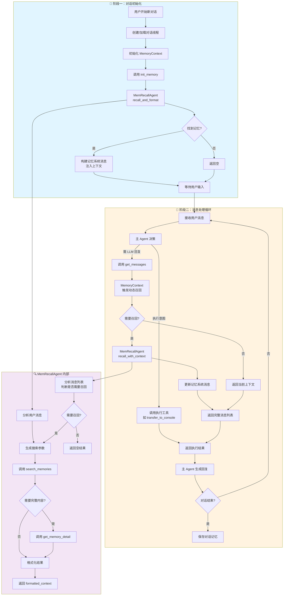

# MemoryContext 需求文档

## 文档信息
- **版本**: 1.0
- **日期**: 2026-02-10
- **状态**: 草案

### 文档分工说明

| 文档 | 职责范围 | 链接 |
|------|----------|------|
| **本文档** | MemoryContext 需求、架构流程、与上下游交互接口 | - |
| Memory Data Layer PRD | 数据表 Schema、搜索算法实现（语义/关键词/混合搜索）| [查看](./memory_data_layer_prd.md) |
| MemRecallAgent Tools | 工具函数签名、Pydantic 输入输出模型 | [查看](./memrecall_agent_tools.md) |
| MemRecallAgent Implementation | MemRecallAgent 类实现、工作模式、内部逻辑 | [查看](./memrecall_agent_implementation.md) |

**原则**: 本文档不重复描述其他文档已定义的内容，仅引用其接口。

---

## 1. 背景与目标

### 1.1 当前问题
- **搜索能力局限**: 仅支持 SQL `ILIKE` 子串匹配，无向量相似度，无法语义理解
- **查询机制僵化**: `init_memory()` 一次性生成查询，对话中无法动态搜索
- **关键词管理缺失**: 无关键词提取和索引机制

### 1.2 目标
1. **动态记忆召回**: 对话初始化 + 主 Agent 调用 LLM 前自动触发记忆搜索
2. **增强搜索能力**: 语义 + 关键词 + 混合搜索（依赖 Data Layer 实现）
3. **职责分离**: MemoryContext 管状态协调，MemRecallAgent 管搜索执行

### 1.3 非目标
- 向量数据库实现（保留给后续迭代）
- 跨用户记忆共享
- 记忆自动合并抽象

---

## 2. 架构设计

### 2.1 组件关系

```
┌─────────────────────────────────────────────────────────────┐
│                        主 Agent                              │
│  ┌───────────────────────────────────────────────────────┐  │
│  │  接收用户消息 → 决策 → get_messages() → 调用 LLM      │  │
│  └───────────────────────────────────────────────────────┘  │
└───────────────────────────┬─────────────────────────────────┘
                            │ 调用 get_messages() 时触发
                            ▼
┌─────────────────────────────────────────────────────────────┐
│                   MemoryContext                              │
│  ┌───────────────────────────────────────────────────────┐  │
│  │  init_memory()    - 对话初始化时召回                  │  │
│  │  get_messages()   - 动态召回，返回带记忆的消息列表    │  │
│  │  add_message()    - 存储消息到缓冲区                  │  │
│  └───────────────────────────────────────────────────────┘  │
└───────────────────────────┬─────────────────────────────────┘
                            │ 委托
                            ▼
┌─────────────────────────────────────────────────────────────┐
│                   MemRecallAgent                             │
│  ┌───────────────────────────────────────────────────────┐  │
│  │  分析消息 → 生成搜索参数 → 调用工具 → 返回结果        │  │
│  └───────────────────────────────────────────────────────┘  │
└───────────────────────────┬─────────────────────────────────┘
                            │ 调用
                            ▼
┌─────────────────────────────────────────────────────────────┐
│                   Data Layer                                 │
│  ┌───────────────────────────────────────────────────────┐  │
│  │  search_memories_advanced()                           │  │
│  └───────────────────────────────────────────────────────┘  │
└─────────────────────────────────────────────────────────────┘
```

### 2.2 职责边界

| 组件 | 负责 | 不负责 |
|------|------|--------|
| **MemoryContext** | 管理记忆状态、协调召回时机、注入系统消息 | 具体搜索逻辑、关键词提取 |
| **MemRecallAgent** | 分析意图、生成搜索参数、调用工具搜索、格式化结果 | 执行用户命令、生成最终回复 |
| **主 Agent** | 业务决策、执行命令、生成回复 | 记忆搜索 |

---

## 3. MemoryContext 需求

### 3.1 功能需求

#### FR1: 对话初始化召回
- **触发时机**: 用户开始新对话
- **行为**: 调用 MemRecallAgent 分析初始消息，如有相关记忆则注入系统消息
- **输入**: 用户初始消息
- **输出**: 包含记忆上下文的系统消息列表（可能为空）

#### FR2: 动态记忆召回
- **触发时机**: 主 Agent 调用 `get_messages()` 准备发送给 LLM 前
- **行为**:
  1. 将当前消息列表传给 MemRecallAgent
  2. MemRecallAgent 分析是否需要召回
  3. 如有新记忆，更新系统消息
- **输入**: 当前对话消息列表
- **输出**: [记忆系统消息] + [对话历史消息]

#### FR3: 记忆状态管理
- 存储已召回的记忆列表
- 维护记忆系统消息
- 对话结束时清理状态

### 3.2 接口定义

```python
class MemoryContext(ChatCompletionContext):
    def __init__(
        self,
        *,
        data_layer: AgentFusionDataLayer,
        user_id: int,
        memory_model_client: ChatCompletionClient,
    ):
        """
        Args:
            data_layer: 数据层访问接口（用于初始化 MemRecallAgent）
            user_id: 当前用户 ID（数据隔离）
            memory_model_client: 用于记忆召回的 LLM 客户端
        """

    async def init_memory(self, user_message: str) -> List[LLMMessage]:
        """
        对话初始化时的记忆召回

        流程:
        1. 调用 MemRecallAgent.recall_and_format(user_message)
        2. 如有结果，构建记忆系统消息
        3. 返回系统消息列表
        """

    async def get_messages(self) -> List[LLMMessage]:
        """
        获取包含记忆上下文的完整消息列表

        触发时机: 主 Agent 调用 LLM 前

        流程:
        1. 调用 MemRecallAgent.recall_with_context(messages)
        2. 如有新记忆，更新系统消息
        3. 返回 [记忆系统消息] + [对话历史]
        """

    async def add_message(self, message: LLMMessage) -> None:
        """添加消息到内部缓冲区"""

    def clear_memory_context(self) -> None:
        """清除记忆上下文（对话结束时调用）"""
```

### 3.3 与 MemRecallAgent 协作

MemoryContext 通过以下接口调用 MemRecallAgent:

```python
# 初始化召回
result = await self.recall_agent.recall_and_format(user_message)

# 动态召回
result = await self.recall_agent.recall_with_context(messages)

# 返回结果类型: MemRecallResult（定义见 memrecall_agent_tools.md）
class MemRecallResult(BaseModel):
    action: Literal["RECALL_SUCCESS", "NO_RELEVANT_MEMORY"]
    formatted_context: str  # 格式化后的记忆文本
    memories: List[MemorySearchResultItem]
    confidence: float
```

---

## 4. 流程图

### 4.1 完整交互流程



### 4.2 关键流程说明

#### 流程 1：初始化召回
```
触发: 用户开始新对话
调用: MemoryContext.init_memory(user_message)

1. 调用 MemRecallAgent.recall_and_format()
2. MemRecallAgent 分析 → 搜索 → 格式化
3. MemoryContext 将 formatted_context 包装为系统消息
4. 返回系统消息（作为主 Agent 的 system message）
```

#### 流程 2：动态召回
```
触发: 主 Agent 准备调用 LLM 前
调用: MemoryContext.get_messages()

1. MemoryContext 将消息列表传给 MemRecallAgent
2. MemRecallAgent.recall_with_context() 分析是否需要召回
3. 如需要，执行搜索并返回 formatted_context
4. MemoryContext 更新记忆系统消息
5. 返回 [记忆系统消息] + [对话历史]
```

---

## 5. 记忆系统消息格式

### 5.1 系统消息结构

MemoryContext 构建的系统消息：

```markdown
## 历史记忆上下文

以下是根据用户当前问题召回的相关历史记忆。请在回复时参考这些信息：

{formatted_context}

---

## 记忆使用指南

1. **命令类记忆**: 如果用户要求"重新执行"、"再次运行"等，使用记忆中的完整命令
2. **信息类记忆**: 基于记忆中的信息回答用户问题
3. **无相关记忆**: 如果记忆不足以回答用户，正常对话即可

搜索摘要: {search_summary}
```

### 5.2 formatted_context 示例

由 MemRecallAgent 生成，MemoryContext 直接嵌入：

```markdown
### 历史命令 [cmd-001]
命令: python train.py --epochs 100 --batch-size 32
摘要: 训练 ResNet50 模型

### 历史记忆 [db-config-001]
摘要: MySQL 主从配置
内容: server-id=1, port=3306, master-host=192.168.1.100...
```

---

## 6. 依赖接口

### 6.1 依赖 MemRecallAgent

定义见 [memrecall_agent_implementation.md](./memrecall_agent_implementation.md)：

```python
class MemRecallAgent:
    async def recall_and_format(self, user_message: str) -> MemRecallResult
    async def recall_with_context(self, messages: List[LLMMessage]) -> MemRecallResult
```

### 6.2 依赖 Data Layer

定义见 [memory_data_layer_prd.md](./memory_data_layer_prd.md)：

```python
class MemoryModel:
    async def search_memories_advanced(
        self,
        user_id: int,
        query: str,
        keywords: Optional[List[str]],
        search_mode: Literal["semantic", "keyword", "hybrid"],
        ...
    ) -> List[MemorySearchResult]
```

### 6.3 依赖工具模型

定义见 [memrecall_agent_tools.md](./memrecall_agent_tools.md)：

- `MemRecallResult` - MemRecallAgent 返回结果
- `MemorySearchResultItem` - 单条记忆结果

---

## 7. 实现计划

### 阶段一：MemoryContext 基础
- [ ] 实现 `MemoryContext` 类继承 `ChatCompletionContext`
- [ ] 实现 `init_memory()` 初始化召回
- [ ] 实现 `get_messages()` 动态召回触发
- [ ] 实现记忆状态管理

### 阶段二：集成 MemRecallAgent
- [ ] 集成 `MemRecallAgent` 作为子组件
- [ ] 实现 `init_memory()` 调用 `recall_and_format()`
- [ ] 实现 `get_messages()` 调用 `recall_with_context()`

### 阶段三：与主 Agent 集成
- [ ] 主 Agent 使用 `MemoryContext` 替代普通 `ChatCompletionContext`
- [ ] 测试完整交互流程

### 阶段四：测试
- [ ] 单元测试：MemoryContext 各方法
- [ ] 集成测试：MemoryContext + MemRecallAgent + Data Layer
- [ ] 端到端测试：完整对话流程

---

## 8. 附录：相关文档索引

| 文档 | 关键内容 | 章节 |
|------|----------|------|
| [memory_data_layer_prd.md](./memory_data_layer_prd.md) | 数据表 Schema、搜索算法 | 第 2 节、第 4 节 |
| [memrecall_agent_tools.md](./memrecall_agent_tools.md) | 工具输入输出模型 | 第 2 节、第 8 节 |
| [memrecall_agent_implementation.md](./memrecall_agent_implementation.md) | MemRecallAgent 类、工作模式 | 第 2 节、第 2.4 节 |
