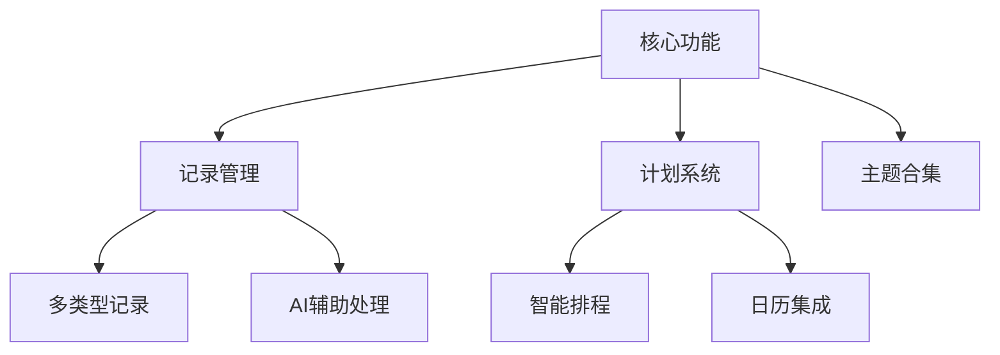

# IdeaPilot - 产品需求文档  
**版本号：** v1.0.0  
**日期：** 2023-12-15  
**作者：** [您的姓名]  
**状态：** 评审中  
**分发对象：** 产品经理、开发团队、设计团队、QA  

---

## 版本控制  
| 版本 | 日期 | 作者 | 变更说明 | 审核人 |
|------|------|------|----------|--------|
| v1.0.0 | 2023-12-15 | [作者] | 初始版本 | - |

---

## 背景说明  
### 目的
构建一个AI辅助的智能日志记录与生活管理平台，帮助用户轻松捕捉日常点滴、智能组织信息、规划任务日程，并进行回顾追踪。  

### 范围  
**包含：**  
- 多类型记录（文本/语音/图片/旅行/备忘）  
- 主题合集管理  
- 智能计划排程  
- 跨平台日历集成  
- AI辅助功能（摘要/标签/行动项提取）  

**不包含：**  
- 团队协作功能（V2规划）  
- 第三方应用深度集成  

### 目标用户  
- 个人日记记录者  
- 旅行规划爱好者  
- 生活管理需求者  
- 学生及自由职业者  

### 术语定义  
| 术语 | 定义 |  
|------|------|  
| 主题/合集 | 相关记录的集合（如"巴黎旅行"） |  
| 行动项 | 从记录中提取的可执行任务 |  

### 参考依据  
- 用户调研报告-2023Q4  
- 竞品分析文档

---

## 产品概览  
### 价值主张  
"用AI简化生活记录，让规划自动发生"  

### 功能地图


### 用户画像
**主要角色：**  
1. 忙碌的职场人Lisa：需要记录会议灵感并转化为待办  
2. 旅行爱好者Mike：规划复杂行程并避免时间冲突  

### 前提条件
**假设：**  
- 用户有定期记录习惯  
- 移动设备支持语音输入  

**依赖：**
- 日历API接入（Google/Apple Calendar）  

### 约束条件  
- 首版仅支持移动端（iOS/Android）  
- 离线功能有限制  

---

## 功能规格（按场景组织）  

### 场景1：快速记录灵感  
**需求编号：** FUNC-001  
**功能名称：** 速记捕捉  
**行为描述：** 用户通过任意界面入口快速输入文字/语音片段  
**优先级：** P0  
**业务规则：**  
- 自动保存为"速记"类型  
- 未分类记录需在24小时内提醒处理  

**状态条件：**  
- 前置：用户授权麦克风权限（语音时）  
- 后置：生成带时间戳的记录  

**交互参考：** [Figma链接]  
**数据规范：**  
```json
{
  "type": "quick_note",
  "content": "字符串≤500字",
  "created_at": "ISO8601"
}
```
**验收标准：**  
Given 用户点击底部"+"按钮，When 选择"速记"类型并输入内容，Then 系统在3秒内完成保存  

---

### 场景2：旅行计划管理  
**需求编号：** FUNC-012  
**功能名称：** 行程冲突检测  
**行为描述：** AI分析行程点间的交通时间合理性  
**优先级：** P1  
**业务规则：**  
- 相邻地点间需预留最低交通时间  
- 机场行程需提前2小时提醒  

**交互参考：** [Figma链接]  
**验收标准：**  
Given 用户添加了10:00埃菲尔铁塔和11:00卢浮宫的行程，When 系统检测到最短交通需90分钟，Then 显示红色冲突警告  

---

## 质量要求  
### 性能指标  
- 列表加载时间≤1.5秒  
- AI处理响应≤3秒  

### 安全标准  
- 本地数据加密存储  
- 符合GDPR规范  

### 体验原则  
1. 三次点击内完成核心操作  
2. 错误操作可一键恢复  

### 兼容要求  
- iOS 15+/Android 10+  
- 黑暗模式支持  

### 扩展能力  
- 预留API接入点  
- 数据结构支持插件扩展  

---

## 发布策略
### 版本规划  
| 阶段 | 时间 | 功能集 |  
|------|------|--------|  
| MVP | 2024Q1 | 基础记录+计划 |  
| V1.5 | 2024Q2 | 高级分析报表 |  

### 功能清单  
**必选：**  
- 多类型记录创建  
- 智能日历排程  

**可选：**  
- 语音转文字高级编辑  
- 旅行路线地图可视化  

---

## 补充材料  
### 设计资产  
- 高保真原型 [Figma链接]  
- 图标系统 [SVG库]  

### 技术方案  
- 架构图 [Confluence链接]  
