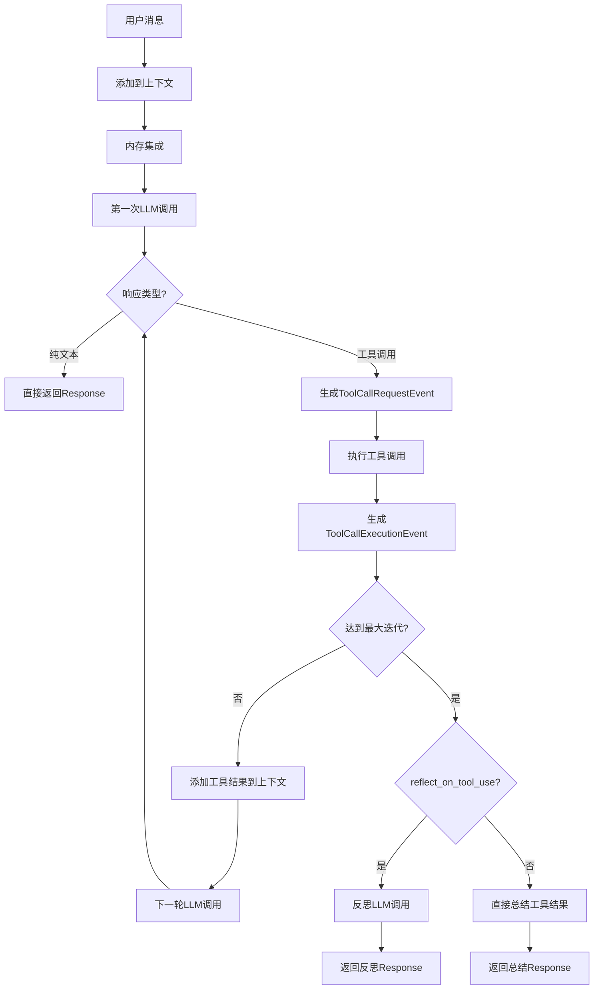

# AutoGen AssistantAgent 完整流程解析

基于 `autogen_agentchat.agents._assistant_agent.py` 源码的详细分析

## 整体架构概览

AssistantAgent 的 `on_messages_stream` 方法是一个复杂的多阶段处理流程，支持：
- 流式响应
- 工具调用循环
- 内存集成
- 反思机制
- 结构化输出

## 详细流程解析

### 🚀 **主入口：on_messages_stream() (行 901-1010)**

#### **阶段1：状态收集和初始化 (行 916-931)**
```python
# 收集所有相关状态
agent_name = self.name
model_context = self._model_context
memory = self._memory
system_messages = self._system_messages
workbench = self._workbench
handoff_tools = self._handoff_tools
# ... 等等
```

#### **阶段2：消息上下文管理 (行 932-946)**
```python
# STEP 1: 将新的用户/移交消息添加到模型上下文
await self._add_messages_to_context(
    model_context=model_context,
    messages=messages,
)

# STEP 2: 使用相关内存更新模型上下文
for event_msg in await self._update_model_context_with_memory(...):
    inner_messages.append(event_msg)
    yield event_msg
```

#### **阶段3：第一次LLM推理 (行 948-986)**
```python
# STEP 4: 运行第一次推理
async for inference_output in self._call_llm(...):
    if isinstance(inference_output, CreateResult):
        model_result = inference_output
    else:
        # 流式块事件
        yield inference_output

# 处理隐藏的"思考"内容
if model_result.thought:
    thought_event = ThoughtEvent(content=model_result.thought, source=agent_name)
    yield thought_event

# 将助手消息添加到模型上下文
await model_context.add_message(AssistantMessage(...))
```

#### **阶段4：模型结果处理 (行 988-1009)**
```python
# STEP 5: 处理模型输出
async for output_event in self._process_model_result(...):
    yield output_event
```

---

### 🔧 **核心方法1：_call_llm() (行 1053-1114)**

**职责**：执行实际的LLM推理调用

#### **关键步骤：**

1. **上下文准备 (行 1083-1086)**：
   ```python
   all_messages = await model_context.get_messages()
   llm_messages = cls._get_compatible_context(model_client=model_client, messages=system_messages + all_messages)
   tools = [tool for wb in workbench for tool in await wb.list_tools()] + handoff_tools
   ```

2. **流式 vs 非流式处理 (行 1088-1113)**：
   ```python
   if model_client_stream:
       async for chunk in model_client.create_stream(...):
           if isinstance(chunk, CreateResult):
               model_result = chunk
           elif isinstance(chunk, str):
               yield ModelClientStreamingChunkEvent(content=chunk, source=agent_name, full_message_id=message_id)
   else:
       model_result = await model_client.create(...)
   ```

**关键特性**：
- ✅ 支持流式和非流式推理
- ✅ 自动工具集成
- ✅ 消息ID关联用于流式块追踪
- ✅ 兼容性检查（视觉等）

---

### ⚙️ **核心方法2：_process_model_result() (行 1116-1340+)**

**职责**：处理LLM返回的结果，支持工具调用循环

#### **工具调用循环逻辑 (行 1147-1296)**：

```python
for loop_iteration in range(max_tool_iterations):
    # 情况1：纯文本响应 (行 1148-1173)
    if isinstance(current_model_result.content, str):
        if output_content_type:
            # 结构化输出
            content = output_content_type.model_validate_json(current_model_result.content)
            yield Response(chat_message=StructuredMessage[output_content_type](...))
        else:
            # 普通文本输出
            yield Response(chat_message=TextMessage(...))
        return
    
    # 情况2：工具调用 (行 1175-1296)
    assert isinstance(current_model_result.content, list) and all(
        isinstance(item, FunctionCall) for item in current_model_result.content
    )
    
    # 4A: 生成工具调用请求事件
    tool_call_msg = ToolCallRequestEvent(content=current_model_result.content, ...)
    yield tool_call_msg
    
    # 4B: 执行工具调用（支持流式）
    async def _execute_tool_calls(...):
        # 并行执行所有工具调用
        results = await asyncio.gather(*[
            cls._execute_tool_call_with_streaming(...)
            for call in function_calls
        ])
    
    # 4C: 处理工具执行结果
    for call, result in calls_and_results:
        tool_result_msg = ToolCallExecutionEvent(...)
        yield tool_result_msg
        
        # 检查移交操作
        if call.name in handoffs:
            handoff_msg = cls._create_handoff_message(...)
            yield Response(chat_message=handoff_msg, ...)
            return
    
    # 4D: 将工具结果添加到上下文，准备下一轮推理
    for call, result in calls_and_results:
        await model_context.add_message(ToolResultMessage(...))
    
    # 4E: 如果达到最大迭代次数，进行下一轮LLM调用
    if loop_iteration < max_tool_iterations - 1:
        async for inference_output in cls._call_llm(...):
            if isinstance(inference_output, CreateResult):
                current_model_result = inference_output
            else:
                yield inference_output
```

#### **反思或总结阶段 (行 1297-1340)**：

```python
# 循环结束后，根据配置进行反思或总结
if reflect_on_tool_use:
    # 反思流程：第二次LLM调用
    async for reflection_response in cls._reflect_on_tool_use_flow(
        system_messages=system_messages,
        model_client=model_client,
        model_client_stream=model_client_stream,
        model_context=model_context,
        workbench=workbench,
        handoff_tools=handoff_tools,
        agent_name=agent_name,
        inner_messages=inner_messages,
        output_content_type=output_content_type,
        cancellation_token=cancellation_token,
    ):
        yield reflection_response
else:
    # 直接总结：格式化工具执行结果
    summary_content = cls._summarize_tool_use(
        executed_calls_and_results,
        tool_call_summary_format,
        tool_call_summary_formatter,
    )
    yield Response(chat_message=ToolCallSummaryMessage(...))
```

---

### 🤔 **反思流程：_reflect_on_tool_use_flow() (行 1380-1460+)**

**职责**：对工具使用结果进行LLM反思，生成自然语言解释

#### **关键特性**：
1. **第二次LLM调用**：使用包含工具结果的完整上下文
2. **禁用工具**：`tool_choice="none"` 防止递归工具调用
3. **结构化输出支持**：确保输出符合指定格式
4. **流式支持**：支持流式反思响应

```python
async for chunk in model_client.create_stream(
    llm_messages,
    json_output=output_content_type,
    cancellation_token=cancellation_token,
    tool_choice="none",  # 关键：不使用工具
):
    if isinstance(chunk, CreateResult):
        # 处理最终反思结果
        reflection_content = chunk.content
        if output_content_type:
            content = output_content_type.model_validate_json(reflection_content)
            yield Response(chat_message=StructuredMessage[output_content_type](...))
        else:
            yield Response(chat_message=TextMessage(...))
    elif isinstance(chunk, str):
        # 流式反思块
        yield ModelClientStreamingChunkEvent(...)
```

---

## 🔄 **完整流程图**



---

## 🎯 **关键设计特性**

### **1. 多次LLM调用的合理性**
- **第一次**：生成初始响应或工具调用
- **中间轮次**：基于工具结果的后续推理（工具调用循环）
- **最后一次**：反思工具使用结果，生成用户友好的解释

### **2. 流式处理支持**
- 所有LLM调用都支持流式响应
- 工具执行也支持流式事件
- 用户可以实时看到处理进度

### **3. 工具调用循环**
- 支持最多 `max_tool_iterations` 轮工具调用
- 每轮可以基于前一轮的工具结果进行新的推理
- 支持复杂的多步骤任务

### **4. 灵活的输出格式**
- 支持纯文本响应
- 支持结构化JSON输出
- 支持工具执行总结

### **5. 错误处理和移交**
- 支持任务移交机制
- 完善的异常处理
- 取消令牌支持

---

## 📊 **与 CodeAgent 的对比**

| 特性 | AssistantAgent | CodeAgent |
|------|----------------|-----------|
| **LLM调用次数** | 1-N次（循环+反思） | 1次 |
| **工具类型** | 通用工具 | 专用代码执行 |
| **流式处理** | 全流程流式 | 实时代码监控 |
| **复杂度** | 高（多轮推理） | 中（单轮监控） |
| **适用场景** | 复杂任务协作 | 代码执行和解释 |
| **输出格式** | 多种格式 | 执行结果直出 |

这种设计使得 AssistantAgent 能够处理复杂的多步骤任务，而 CodeAgent 则专注于高效的代码执行体验。